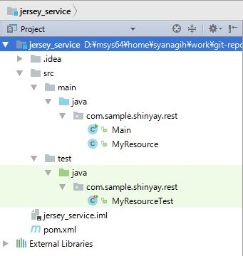
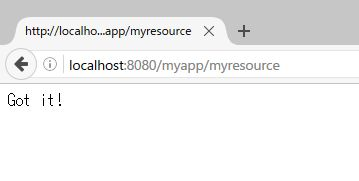
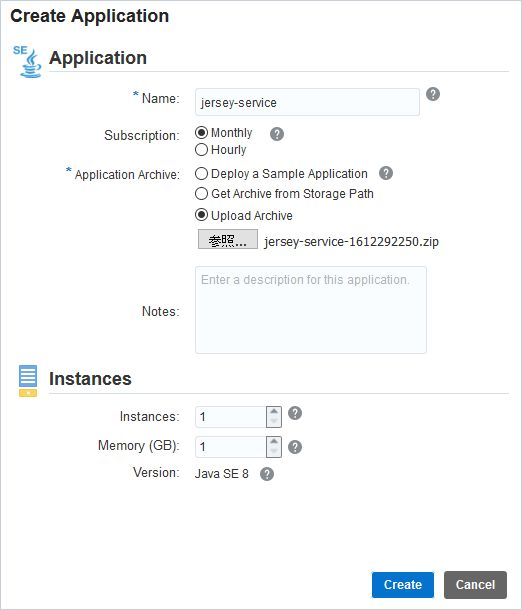
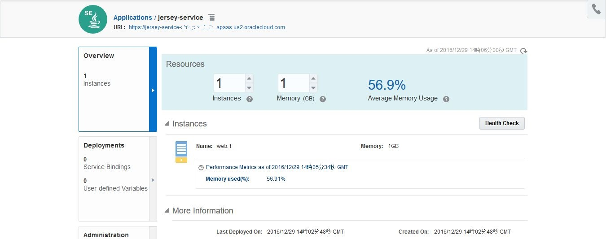
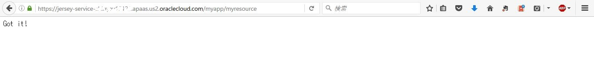

# Oracle Application Container Cloud Service - Jersey & Grizzly を用いた REST アプリケーション
---
## 説明

Java EE アプリケーションサーバを利用せず、軽量な Grizzly Web サーバと、Jersey REST フレームワークを使用して RESTful アプリケーションを開発します。

#### **Grizzly Web サーバ**

[Project Grizzly](https://grizzly.java.net/) とは、NIO API を使用したピュア Java Web サーバ・エンジンです。主な用途は、GlassFish アプリケーションサーバの Web サーバ・コンポーネントとして利用されています。


#### **Jersey, REST, and JAX-RS**

Jersey とは、RESTful アプリケーションを開発に利用されるオープンソースのフレームワークです。Jersey は、JAX-RS API をサポートしており、また JAX-RS 参照実装となっています。

REST はスケーラブルな Web サービスを開発すると際のソフトウェア・アーキテクチャ・スタイルです。REST は、SOAP や WSDL による Web サービスよりもシンプルです。RESTful Web サービスですは、HTTP 経由で通信し、Webブラウザ同様に HTTP のメソッド(GET, POST, PUT, DELETE など) を使用してリモートサーバと通信します。

## 作成するアプリケーション
LIST に格納さえれているデータに対して、2種類のメソッドを作成します。

1. LIST 内の全てのデータを返す
2. ID によりデータを特定する

データは平文テキストデータとして扱います。

## 前提

- [Maven 3.3.1 以上](https://maven.apache.org/)
- [Java SE 8u45 以降](http://www.oracle.com/technetwork/java/javase/downloads/index.html)
- 統合開発環境 (EWclipse, NetBeans, など)
- [cURL](http://curl.haxx.se/)

## 手順

### Maven プロジェクトの作成

**Jersey** と **Grizzly** を用いたアプリケーションを作成する時に、雛形の用意には **Maven** を使用します。

次のコマンド・オプションを用いて Maven を実行します:

```bash
mvn archetype:generate -DarchetypeGroupId=org.glassfish.jersey.archetypes -DarchetypeArtifactId=jersey-quickstart-grizzly2 -DarchetypeVersion=2.25 -DinteractiveMode=false -DgroupId=com.sample.shinyay.rest -DartifactId=jersey_service -Dpackage=com.sample.shinyay.rest -DarchetypeVersion=2.25
```
#### Maven で作成したプロジェクトのディレクトリ構造

mvn コマンドにより作成されるディレクトリ構造は次のようになります:




#### Maven で作成した pom.xml

また、 生成された **pom.xml** を確認します。

```xml
<project xmlns="http://maven.apache.org/POM/4.0.0" xmlns:xsi="http://www.w3.org/2001/XMLSchema-instance"
         xsi:schemaLocation="http://maven.apache.org/POM/4.0.0 http://maven.apache.org/maven-v4_0_0.xsd">

    <modelVersion>4.0.0</modelVersion>

    <groupId>com.sample.shinyay.rest</groupId>
    <artifactId>jersey_service</artifactId>
    <packaging>jar</packaging>
    <version>1.0-SNAPSHOT</version>
    <name>jersey_service</name>

    <dependencyManagement>
        <dependencies>
            <dependency>
                <groupId>org.glassfish.jersey</groupId>
                <artifactId>jersey-bom</artifactId>
                <version>${jersey.version}</version>
                <type>pom</type>
                <scope>import</scope>
            </dependency>
        </dependencies>
    </dependencyManagement>

    <dependencies>
        <dependency>
            <groupId>org.glassfish.jersey.containers</groupId>
            <artifactId>jersey-container-grizzly2-http</artifactId>
        </dependency>
        <!-- uncomment this to get JSON support:
         <dependency>
            <groupId>org.glassfish.jersey.media</groupId>
            <artifactId>jersey-media-moxy</artifactId>
        </dependency>
        -->
        <dependency>
            <groupId>junit</groupId>
            <artifactId>junit</artifactId>
            <version>4.9</version>
            <scope>test</scope>
        </dependency>
    </dependencies>

    <build>
        <plugins>
            <plugin>
                <groupId>org.apache.maven.plugins</groupId>
                <artifactId>maven-compiler-plugin</artifactId>
                <version>2.5.1</version>
                <inherited>true</inherited>
                <configuration>
                    <source>1.7</source>
                    <target>1.7</target>
                </configuration>
            </plugin>
            <plugin>
                <groupId>org.codehaus.mojo</groupId>
                <artifactId>exec-maven-plugin</artifactId>
                <version>1.2.1</version>
                <executions>
                    <execution>
                        <goals>
                            <goal>java</goal>
                        </goals>
                    </execution>
                </executions>
                <configuration>
                    <mainClass>com.sample.shinyay.rest.Main</mainClass>
                </configuration>
            </plugin>
        </plugins>
    </build>

    <properties>
        <jersey.version>2.25</jersey.version>
        <project.build.sourceEncoding>UTF-8</project.build.sourceEncoding>
    </properties>
</project>
```

**dependencyManagement** 要素によって、REST に関する **jersey** 関連の依存ライブラリのバージョンを定義しています。

- [参考: POM Reference / Dependency Management](https://maven.apache.org/pom.html#Dependency_Management)

**dependencyManagement** で Jersesy の使用が管理されているので、**dependency** 要素で定義を行っている ***jersey-container-grizzly2-http*** では、使用バージョンに関する定義は行っていません。

また、ビルド・プラグインとして定義されている **maven-compiler-plugin** では、使用する Java のバージョンが ***1.7*** になっています。これを、***1.8*** に変更します。

#### Maven で作成した Java ソースファイル

**jersey-quickstart-grizzly2** によって Java ソースファイルが2つ作成されています。

- Main.java
- MyResource.java

##### Main.java

ここでは、Grizzly による HttpServer の起動を行っています。

```java
package com.sample.shinyay.rest;

import org.glassfish.grizzly.http.server.HttpServer;
import org.glassfish.jersey.grizzly2.httpserver.GrizzlyHttpServerFactory;
import org.glassfish.jersey.server.ResourceConfig;

import java.io.IOException;
import java.net.URI;

/**
 * Main class.
 *
 */
public class Main {
    // Base URI the Grizzly HTTP server will listen on
    public static final String BASE_URI = "http://localhost:8080/myapp/";

    /**
     * Starts Grizzly HTTP server exposing JAX-RS resources defined in this application.
     * @return Grizzly HTTP server.
     */
    public static HttpServer startServer() {
        // create a resource config that scans for JAX-RS resources and providers
        // in com.sample.shinyay.rest package
        final ResourceConfig rc = new ResourceConfig().packages("com.sample.shinyay.rest");

        // create and start a new instance of grizzly http server
        // exposing the Jersey application at BASE_URI
        return GrizzlyHttpServerFactory.createHttpServer(URI.create(BASE_URI), rc);
    }

    /**
     * Main method.
     * @param args
     * @throws IOException
     */
    public static void main(String[] args) throws IOException {
        final HttpServer server = startServer();
        System.out.println(String.format("Jersey app started with WADL available at "
                + "%sapplication.wadl\nHit enter to stop it...", BASE_URI));
        System.in.read();
        server.stop();
    }
}

```

**BASE_URI** は、REST メソッドを追加する URI を指定しています。
**ResourceConfig** クラスは、アノテーションされる Jersey のクラスが配置されるパッケージを指定します。

##### MyResource.java

**MyResource** クラスは、REST メソッドによる操作を定義しています。このデフォルトの状態では、`http://localhost:8080/myapp/myresource` に対して `GET` でアクセスすると動作します。

```java
package com.sample.shinyay.rest;

import javax.ws.rs.GET;
import javax.ws.rs.Path;
import javax.ws.rs.Produces;
import javax.ws.rs.core.MediaType;

/**
 * Root resource (exposed at "myresource" path)
 */
@Path("myresource")
public class MyResource {

    /**
     * Method handling HTTP GET requests. The returned object will be sent
     * to the client as "text/plain" media type.
     *
     * @return String that will be returned as a text/plain response.
     */
    @GET
    @Produces(MediaType.TEXT_PLAIN)
    public String getIt() {
        return "Got it!";
    }
}

```

### 動作確認

動作確認をしてみます。まず、コンパイルを行います。

```bash
$ mvn clean compile
[INFO] Scanning for projects...
[INFO]
[INFO] ------------------------------------------------------------------------
[INFO] Building jersey_service 1.0-SNAPSHOT
[INFO] ------------------------------------------------------------------------
[INFO]
[INFO] --- maven-clean-plugin:2.5:clean (default-clean) @ jersey_service ---
[INFO] Deleting D:\msys64\home\syanagih\work\git-repo\oracle-accs-basic-rest-app\maven\jersey_service\target
[INFO]
[INFO] --- maven-resources-plugin:2.6:resources (default-resources) @ jersey_service ---
[INFO] Using 'UTF-8' encoding to copy filtered resources.
[INFO] skip non existing resourceDirectory D:\msys64\home\syanagih\work\git-repo\oracle-accs-basic-rest-app\maven\jersey_service\src\main\resources
[INFO]
[INFO] --- maven-compiler-plugin:2.5.1:compile (default-compile) @ jersey_service ---
[INFO] Compiling 2 source files to D:\msys64\home\syanagih\work\git-repo\oracle-accs-basic-rest-app\maven\jersey_service\target\classes
[INFO] ------------------------------------------------------------------------
[INFO] BUILD SUCCESS
[INFO] ------------------------------------------------------------------------
[INFO] Total time: 1.897 s
[INFO] Finished at: 2016-12-24T07:39:37+09:00
[INFO] Final Memory: 15M/212M
[INFO] ------------------------------------------------------------------------
```

次に、Main メソッドを実行して Grizzly を起動します。

```bash
$ mvn exec:java
[INFO] Scanning for projects...
[INFO]
[INFO] ------------------------------------------------------------------------
[INFO] Building jersey_service 1.0-SNAPSHOT
[INFO] ------------------------------------------------------------------------
[INFO]
[INFO] >>> exec-maven-plugin:1.2.1:java (default-cli) > validate @ jersey_service >>>
[INFO]
[INFO] <<< exec-maven-plugin:1.2.1:java (default-cli) < validate @ jersey_service <<<
[INFO]
[INFO] --- exec-maven-plugin:1.2.1:java (default-cli) @ jersey_service ---
12 24, 2016 7:41:32 午前 org.glassfish.grizzly.http.server.NetworkListener start
情報: Started listener bound to [localhost:8080]
12 24, 2016 7:41:32 午前 org.glassfish.grizzly.http.server.HttpServer start
情報: [HttpServer] Started.
Jersey app started with WADL available at http://localhost:8080/myapp/application.wadl
Hit enter to stop it...
```

起動したら、REST API のエンドポイントにブラウザからアクセスしてみます。

- http://localhost:8080/myapp/myresource



正常に動作した事が確認できます。

### Fat JAR / Uber JAR の作成

**Uber JAR** (Fat JAR) は、全ての依存ライブラリを含んでいる JAR ファイルです。この Uber JAR を利用すると、複雑なクラスパスや、その他のソフトウェアのインストールなどといった事を考慮することなく、作成したアプリケーションの配布が行えます。
それでは、Uber JAR を作成するために、**pom.xml** を変更していきます。

#### pom.xml の更新

Maven ではアプリケーションを作成すると、デフォルトではソースコードから生成されるクラスファイルのみが JAR ファイルに含まれます。しかし、このアプリケーションが稼働するために必要な依存ライブラリはふくまれていないため、Maven がダウンロードとしてローカルキャッシュとしているライブラリを使用するなどして動作します。
今回のアプリケーションの場合、**Grizzly** と **Jersey** に対して依存しているため、それらのライブラリに対するクラスパスを通す必要があり、配布する場合も配布先に用意する必要があります。そのため、このような依存ライブラリ を含むように `pom.xml` を修正します。

以下のように **maven-assembly-plugin** を追加・構成します。これは、Maven プロジェクトで JAR や WAR などのアーカイブファイルを作成する際に使用するプラグインです:

```xml
<plugin>
    <groupId>org.apache.maven.plugins</groupId>
    <artifactId>maven-assembly-plugin</artifactId>
    <configuration>
        <descriptorRefs>
            <descriptorRef>jar-with-dependencies</descriptorRef>
        </descriptorRefs>
        <archive>
            <manifest>
                <mainClass>com.sample.shinyay.rest.Main</mainClass>
            </manifest>
        </archive>
    </configuration>
    <executions>
        <execution>
            <phase>package</phase>
            <goals>
                <goal>single</goal>
            </goals>
        </execution>
    </executions>
</plugin>
```

**descriptorRef** 要素で、アーカイブ形式を設定します。予め定義されているアーカイブ形式としては、以下の4種類があります:

- bin
  - ${project.basedir} 配下の README*、LICENSE*、NOTICE* と、${project.build.directory} 配下の jar ファイルがアーカイブされる
- jar-with-dependencies
  - 依存している jar ファイルを含めた "uber-jar" を作成
- src
  - ${project.basedir} 配下の README*、LICENSE*、NOTICE* と pom.xml、${project.basedir}/src 配下のファイルが格納される
- project
  - プロジェクトをそのまま格納する

**manifest** 要素で、Uber JAR が実行可能形式 JAR として動作するように Manifet に `mainClass` を設定する事ができます。

#### Uber JAR によるアプリケーション実行

更新した `pom.xml` を使用して、Uber JAR を作成し、アプリケーションを実行してみます。

まずコンパイルを行います:

```
$ mvn clean compile
[INFO] Scanning for projects...
[INFO]
[INFO] ------------------------------------------------------------------------
[INFO] Building jersey_service 1.0-SNAPSHOT
[INFO] ------------------------------------------------------------------------
[INFO]
[INFO] --- maven-clean-plugin:2.5:clean (default-clean) @ jersey_service ---
[INFO]
[INFO] --- maven-resources-plugin:2.6:resources (default-resources) @ jersey_service ---
[INFO] Using 'UTF-8' encoding to copy filtered resources.
[INFO] skip non existing resourceDirectory D:\msys64\home\syanagih\work\git-repo\oracle-accs-basic-rest-app\maven\jersey_service\src\main\resources
[INFO]
[INFO] --- maven-compiler-plugin:2.5.1:compile (default-compile) @ jersey_service ---
[INFO] Compiling 2 source files to D:\msys64\home\syanagih\work\git-repo\oracle-accs-basic-rest-app\maven\jersey_service\target\classes
[INFO] ------------------------------------------------------------------------
[INFO] BUILD SUCCESS
[INFO] ------------------------------------------------------------------------
[INFO] Total time: 2.322 s
[INFO] Finished at: 2016-12-29T07:28:25+09:00
[INFO] Final Memory: 14M/202M
[INFO] ------------------------------------------------------------------------
```

次に JAR ファイルの作成を行います。

```
$ mvn package
[INFO] Scanning for projects...
[INFO]
[INFO] ------------------------------------------------------------------------
[INFO] Building jersey_service 1.0-SNAPSHOT
[INFO] ------------------------------------------------------------------------
[INFO]
[INFO] --- maven-resources-plugin:2.6:resources (default-resources) @ jersey_service ---
[INFO] Using 'UTF-8' encoding to copy filtered resources.
...
...
[INFO] ------------------------------------------------------------------------
[INFO] BUILD SUCCESS
[INFO] ------------------------------------------------------------------------
[INFO] Total time: 12.616 s
[INFO] Finished at: 2016-12-29T07:29:49+09:00
[INFO] Final Memory: 28M/313M
[INFO] ------------------------------------------------------------------------
```

生成された JAR ファイルを実行します:

```
$ cd target
$ java -jar jersey-service-1.0-SNAPSHOT-jar-with-dependencies.jar
12 29, 2016 7:32:36 午前 org.glassfish.grizzly.http.server.NetworkListener start
情報: Started listener bound to [localhost:8080]
12 29, 2016 7:32:36 午前 org.glassfish.grizzly.http.server.HttpServer start
情報: [HttpServer] Started.
Jersey app started with WADL available at http://localhost:8080/myapp/application.wadl
Hit enter to stop it...
```

正常に稼働しました。これは、以下のように JAR ファイルに依存するライブラリが含まれているため、必要な構成が1つの JAR ファイルで成り立っているからです:


```
$ tree -d -L 3
.
├── com
│   ├── sample
│   │   └── shinyay
│   └── sun
│       └── research
...
...

├── jersey
│   └── repackaged
│       ├── com
│       └── org
├── META-INF
│   ├── maven
│   │   ├── javax.annotation
│   │   ├── javax.validation
│   │   ├── javax.ws.rs
│   │   ├── org.glassfish.grizzly
│   │   ├── org.glassfish.hk2
│   │   ├── org.glassfish.hk2.external
│   │   ├── org.glassfish.jersey.bundles.repackaged
│   │   ├── org.glassfish.jersey.containers
│   │   ├── org.glassfish.jersey.core
│   │   ├── org.glassfish.jersey.media
│   │   ├── org.javassist
│   │   └── org.jvnet
│   └── services
└── org
    ├── aopalliance
    │   ├── aop
    │   ├── instrument
    │   ├── intercept
    │   └── reflect
    ├── glassfish
    │   ├── grizzly
    │   ├── hk2
    │   └── jersey
    └── jvnet
        ├── hk2
        └── tiger_types
```

### Application Container Cloud Service 用のアプリケーション構成

**Application Container Cloud Service** は **Docker** を基盤としているクラウド・サービスです。このコンテナ環境という軽量な実行環境を有効活用し、アプリケーションをどこの環境でも同様に稼働させるように工夫をします。環境に依存する情報に関しては、ソースコードや設定ファイルなどに持たず、実行環境から取得するようにします。

12 Factor App にも挙げられている **設定** に関するベスト・プラクティスに準じます:

- [The Twelve Factor App: 設定](https://12factor.net/ja/config)

実際に今回のコードで実施しているのは、**ホスト名** と **ポート番号** を環境変数から取得し、HttpServer インスタンスを起動するようにします:

```java
static{
    protocol = "http://";
    host = Optional.ofNullable(System.getenv("HOSTNAME"));
    port = Optional.ofNullable(System.getenv("PORT"));
    path = "myapp";
    BASE_URI = protocol + host.orElse("localhost") + ":" + port.orElse("8080") + "/" + path + "/";
}
```

ホスト名を環境変数 **HOSTNAME** から取得し、ポート番号は **PORT** から取得します。この時に、環境変数が設定されていない場合は `orElse` メソッドによりデフォルト値としてそれぞれ ***localhost*** 及び ***8080*** ポートが設定されます。これによってクラウド上でなくローカル PC で環境変数を設定せずに稼働させる場合は、 `http://localhost:8080/` で稼働・アクセスできます。

### Application Container Cloud Service 用のアーカイブ・ファイルの作成

最後に Uber JAR とそのアプリケーション用メタ情報を記述した **manifest.json** をパッケージします。

#### manifest.json の作成

manifest.json には、次のような情報を記述します

|大項目|小項目|説明|必須項目|
|---|:---:|:---|:---:|
|runtime|-|-|○|
|-|majorVersion|ランタイム環境のバージョン<br>Javaの場合: 7 / 8<br>Nodeの場合: 0.10 / 0.12 / 4.4 / 6.3<br>PHPの場合: 5.6 / 7.0|○|
|command|-|アプリケーションの実行コマンド|○|
|startupTime|-|アプリケーションの開始までの待機時間(秒)<br>デフォルト: 30秒<br>10 - 120 の間で設定|-|
|release|-|-|-|
|-|build|ビルドを表す値|-|
|-|commit|コミットを表す値|-|
|-|version|バージョンを表す値|-|
|notes|-|任意のコメント|-|
|mode|-|アプリケーション再デプロイメント時の再起動の仕方<br>デフォルト: 同時<br>**rolling**: オプション指定時にローリング再起動|-|
|isClustered|-|**true** 設定時にクラスタとして動作<br>**フェイルオーバー**を行う|-|

ここでは、サンプルとして次のように記載します:

```json
{
    "runtime": {
        "majorVersion": "8"
    },
    "command": "java -jar jersey-service-1.0-SNAPSHOT-jar-with-dependencies.jar",
    "release": {
        "build": "161229.2230",
        "commit": "9df333a48bc31772aee1677ee5821db30c425ddc",
        "version": "0.0.1"
    },
    "notes": "Jersey and Geronimo REST App"
}
```

- **runtime** で **Java 8** を選択
- **command** で **生成した Uber JAR** を実行可能 JAR として実行するコマンドを指定

#### アーカイブ・ファイルの作成

manifest.json と jersey-service-1.0-SNAPSHOT-jar-with-dependencies.jar を含む アーカイブ・ファイルを作成します:

```
$ zip -j jersey-service-1612292250.zip manifest.json target/jersey-service-1.0-SNAPSHOT-jar-with-dependencies.jar
  adding: manifest.json (deflated 34%)
  adding: jersey-service-1.0-SNAPSHOT-jar-with-dependencies.jar (deflated 11%)
```

`jersey-service-1612292250.zip` が Application Container Cloud service にデプロイするアーカイブ・ファイルとなります。

### Application Container Cloud Service へデプロイ

Application Container Cloud Service サービス・コンソールからデプロイします。




デプロイが完了すると、画面左上部にサービス・エンドポイントが表示されます。




この URL に加えてコンテキストルートの `myapp` と、定義しているサービスメソッドであるアクセス先の `myresource` をつけてアクセスします。



正常に動作している事が確認できました。


## まとめ

Grizzly を用いた非サーブレット・コンテナな HTTP サーバ・アプリケーションを作成しました。このような Web アプリケーションは、アプリケーションサーバを用意する必要なく自律的に稼働します。
このような Java SE アプリケーションを稼働させるには、Application Continer Cloud Service は manifest.json の準備のみでよいので簡単にアプリケーション環境を用意する事ができそうです。
